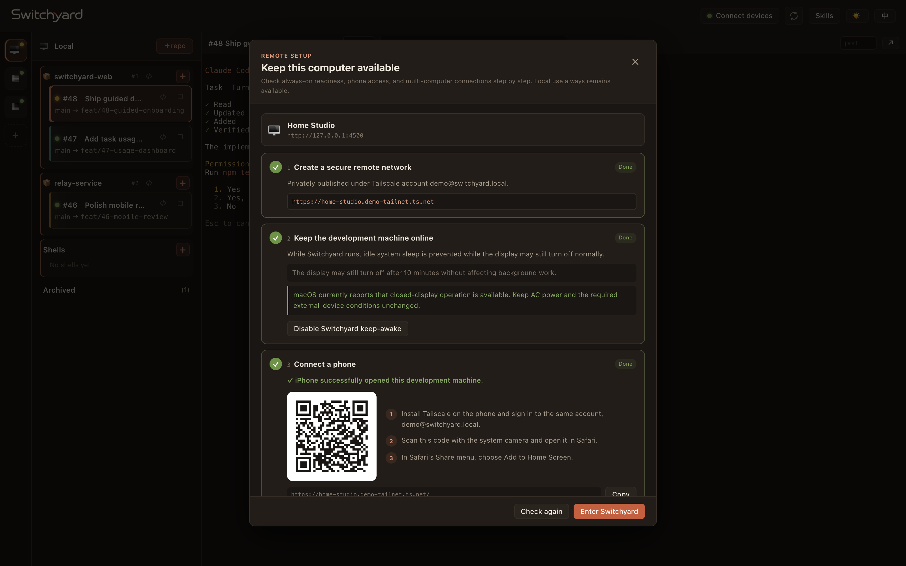
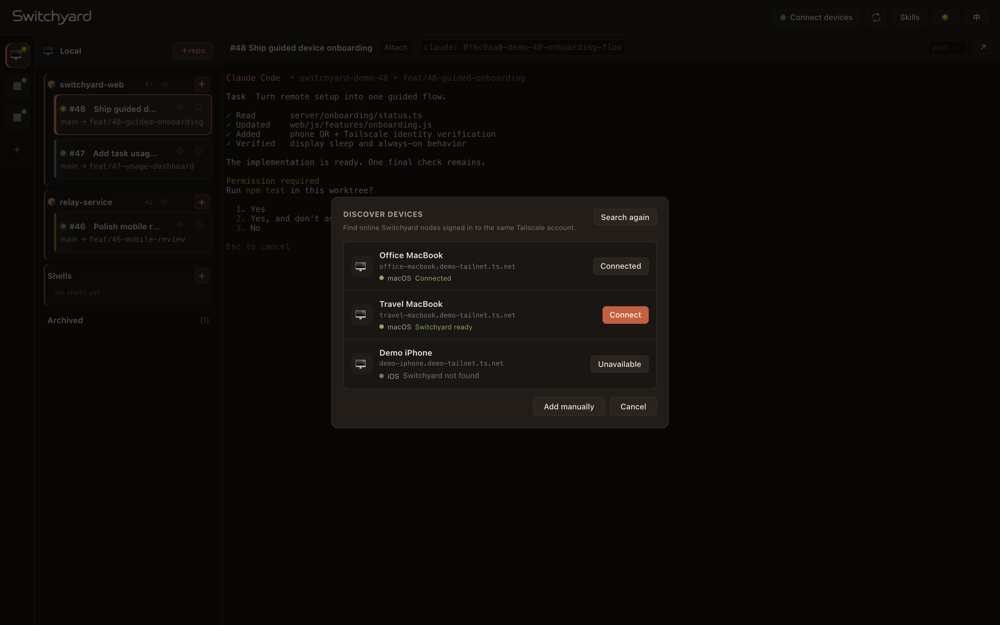

<p align="center">
  
</p>

<p align="center">English · <a href="README.zh-CN.md">简体中文</a></p>

<h3 align="center">Turn your own computers into an always-on AI coding fleet.</h3>

<p align="center">
  Dispatch Claude Code, Codex, or Kimi from your phone.<br>
  Let the work continue in isolated environments, then come back to review or take over.
</p>

<p align="center">
  
</p>

## What Switchyard is

Switchyard is a **local-first control plane for AI coding agents**. It runs on your development machine, gives every task a real git worktree and tmux session, and exposes the same working state to any browser you authorize.

- **Close the browser; the task keeps running.** tmux, not the page, owns the session.
- **Run several tasks without collisions.** Every task has its own branch, worktree, and terminal.
- **Move between laptop and phone without losing context.** Read progress, answer a prompt, or enter the live TUI.
- **Use the agent that fits the task.** Claude Code, Codex, and Kimi Code—including a per-task model such as Kimi K3—can share one board.
- **Add more computers without creating a central server.** Every machine remains a complete, independent Switchyard node and the sole owner of its own work.

The network layer stays deliberately thin:

```text
phone / any browser ── private HTTPS ──► Switchyard on machine A
                                                │
                                                └── SSH control ──► Switchyard on machine B

machine A owns: A's repos · database · worktrees · tmux sessions · agents
machine B owns: B's repos · database · worktrees · tmux sessions · agents
```

Machine A can ask B to create or control a task, but B performs the operation and stores the result. A remote machine without Switchyard is never used as a compatibility shortcut and cannot receive tasks.

## Quick start

Install this once on every computer you want to use as a development machine.

**Requirements:** Node.js 22+, `git`, `tmux`, and zsh. The current one-shot setup preflights both `claude` and `kimi`, so those two binaries must be installed and reachable; Codex is optional and must be checked separately if you plan to use it.

```sh
git clone https://github.com/philontos/switchyard.git
cd switchyard
./scripts/setup.sh
tdsp serve
```

Then open [http://127.0.0.1:4500](http://127.0.0.1:4500). Local task dispatch is ready immediately.

`setup.sh` checks the non-interactive shell used by tmux and SSH, installs npm dependencies, fixes missing Claude/Kimi PATH entries in `~/.zshenv`, and installs the global `tdsp` launcher. It is safe to run again; use `./scripts/setup.sh --check` for a read-only preflight. Before dispatching a Codex task, confirm `codex` is also visible from `zsh -c`.

### Make the machine reachable

Click **Connect devices** in the top bar. This is a persistent status panel—not a disposable first-run wizard. It continually checks:

1. private Tailscale HTTPS;
2. whether the computer can stay awake while Switchyard runs;
3. phone access and its QR code;
4. optional discovery and SSH readiness for other computers.

Each card is derived from live machine state and presents the next useful action. Incomplete remote setup never blocks local use.

<p align="center">
  
</p>

## Connect a phone

1. Install the official [Tailscale client](https://tailscale.com/download) on the computer and phone, then sign both into the same account.
2. Open **Connect devices**. Switchyard checks sign-in and Tailscale Serve permission, then publishes its loopback server through private HTTPS.
3. Scan the QR code with the phone and open it in Safari.
4. Optional but recommended: Safari → Share → **Add to Home Screen** → **Open as Web App**.

The QR code appears only when the private route is usable. Switchyard does not enable Tailscale Funnel or expose the console to the public internet.

## Connect another computer

Run the quick-start steps on that computer too, using the same Tailscale account. From either Switchyard page:

1. click `+` in the machine rail;
2. choose **Discover devices**;
3. click **Connect** next to the discovered Switchyard node;
4. enable SSH / Remote Login if the resulting status asks for it.

<p align="center">
  
</p>

Connecting is bilateral: the nodes verify the same Tailscale owner, exchange stable node identities, exact `tdsp` paths, and dedicated profile-owned SSH keys, then register one another. This exchange can finish before the OS SSH service is enabled; **actual repo, task, terminal, and file operations require SSH** and turn online as soon as Remote Login is ready.

| Layer | Responsibility |
|---|---|
| Tailscale | Private identity, reachability, route selection, and peer discovery |
| HTTPS | Web access, readiness probes, and the initial bilateral connection |
| SSH | Node commands, terminal transport, and file operations |
| Switchyard on the target | The actual repo/task/worktree/tmux/agent operation and all persistent state |

Manual SSH host entry remains available as an advanced fallback when automatic discovery is not appropriate.

## The task loop

1. **Register a repository.** Add a GitHub or GitLab URL; Switchyard creates a local mirror.
2. **Dispatch a task.** Pick the target machine, repo, base branch, agent, optional model, and opening prompt.
3. **Let it run.** Switchyard creates a work branch, isolated worktree, and tmux session on that target machine.
4. **Check in only when useful.** Watch the terminal, read a mobile transcript, paste an image, answer a permission prompt, or attach with tmux.
5. **Wrap up deliberately.** Archive the session while retaining its worktree, clean up both, or remove the record.

<p align="center">
  
</p>

A host reboot or killed tmux session does not destroy the working tree. As long as the worktree remains, **Resume** recreates the session with the saved agent, model, and endpoint. You can also create a repo-free shell from any node's **Shells** group for debugging and one-off commands.

## Agents and models

| Agent | Task configuration | Current Switchyard integration |
|---|---|---|
| **Claude Code** | Machine login or a validated Anthropic-compatible endpoint | Live terminal, resume, image paste, optional skill injection, native permission-waiting signal, local mobile transcript |
| **Codex** | Machine login and optional model ID | Live terminal, resume, image paste, full-access launch, local mobile transcript |
| **Kimi Code / Kimi K3** | Machine login and optional model ID such as `k3` | Interactive `--auto` terminal, resume, and image paste |

The selected agent and model belong to the task and are preserved on resume. Provider credentials stay on the machine that runs the task and are not copied to peers.

Current boundary: extra skill injection and the yellow “needs you” permission signal are Claude Code-only. Remote-node transcripts and Kimi transcripts do not yet have **Read** mode; those tasks open directly in the live terminal.

## Built for the phone

The narrow-screen UI is a full touch workflow, not a scaled-down desktop.

<p align="center">
  
  
  
</p>

- **Board → task navigation** integrates with browser history and the iOS edge-back gesture.
- **Read | Live** switches between a native transcript and the real interactive terminal.
- A **Needs you** banner jumps straight from a readable update to the waiting prompt.
- The input bar follows the software keyboard, supports multiple lines, and keeps an independent unsent draft per task.
- Touch scrolling, terminal momentum, selection, zoom, and standalone web-app launch behavior are tuned for mobile.

## Networking and always-on behavior

Switchyard binds only to `127.0.0.1:4500` by default. Tailscale is the recommended remote path, but it is an optional system dependency—not an npm package:

```sh
tdsp serve --tailscale                  # loopback app + private tailnet HTTPS
tdsp network status                    # Tailscale identity and peers
tdsp network diagnose <peer>           # direct, peer-relay, or DERP path
tdsp network off --https-port 443       # remove only Switchyard's Serve route
```

Tailscale first attempts a WireGuard direct path, then an authorized peer relay, then DERP. Existing private networks remain supported:

```sh
tdsp serve --host-cidr 10.10.0.0/24     # bind the local IP inside an existing WireGuard/LAN range
```

On macOS, **Keep awake while running** creates a reversible, PID-scoped `caffeinate` assertion on AC power. The display may still turn off, and the assertion disappears when Switchyard exits. Closed-lid operation remains subject to macOS and hardware requirements; the guide reports the current condition but does not bypass system protections.

<details>
<summary>Nearby VPS relay for strict NAT or a distant DERP route</summary>

A VPS can run [Tailscale Peer Relay](https://tailscale.com/docs/features/peer-relay) without running Switchyard. It requires Tailscale 1.86+, a reachable UDP port, and a narrowly scoped tailnet grant:

```sh
sudo tailscale set --relay-server-port=40000
# or, when tdsp is installed and authorized to manage tailscaled:
tdsp network relay enable --port 40000
tdsp network diagnose <peer>
```

Use `tdsp network relay disable` to remove only that listener.

</details>

<details>
<summary>Run an isolated side-by-side test profile</summary>

Profiles isolate their sqlite database, namespace, mirrors, worktrees, SSH keys and sockets, launcher, and port while sharing the current checkout:

```sh
npm run -s tdsp -- install --profile canary
~/.task-dispatcher/profiles/canary/bin/tdsp \
  serve --port 14500 --tailscale --tailscale-port 14500
```

This is useful for testing networking without touching a live `:4500` instance.

</details>

## Command reference

| Command | Purpose |
|---|---|
| `tdsp serve [--port N] [--tailscale]` | Start the local console and optionally publish private HTTPS |
| `tdsp serve --host-cidr CIDR` | Also bind this machine's address in an existing private range |
| `tdsp network status/setup/diagnose/off` | Inspect or manage Switchyard's Tailscale path |
| `tdsp list` | Print this node's repositories and tasks as JSON |
| `tdsp create-local` | Create a bare tmux shell on this node |
| `tdsp create` | Create a repository task on this node |
| `tdsp repo-create/repo-fetch/repo-branches/repo-delete` | Operate on this node's repository catalog |
| `tdsp stop/resume/cleanup/delete-task` | Operate on this node's task lifecycle |
| `tdsp doctor legacy [--json]` | Read-only audit for remote state left by older releases |
| `tdsp install [--profile name]` | Install the global launcher or an isolated profile |
| `tdsp update` | Fast-forward the installed checkout and refresh dependencies |

## Security notes

- Treat the web terminal as shell access. Keep it on loopback, a private tailnet, a trusted private CIDR, or behind your own authenticated reverse proxy.
- Do **not** publish `HOST=0.0.0.0` directly to the internet. Switchyard does not currently provide application-level multi-user authentication.
- Repository tokens and provider keys are stored in plaintext in the node's local sqlite database. This release is intended for personal, trusted-machine use.
- Switchyard creates dedicated marked SSH authorization entries for peers; it does not replace your personal SSH keys.
- Each page renders only state owned by the selected node. An unavailable or unbootstrapped node is shown as such rather than falling back to controller-owned data.

## Development

```sh
npm install
npm test
npm run screenshots:readme
```

The screenshot command starts the real web UI against a disposable mock server, drives the flows in headless Chrome, and writes deterministic, sanitized images to `docs/screenshots/`. It never opens a real Switchyard database or tmux session. Set `CHROME_BIN` if Chrome is not installed in its default location.

The main code boundaries are:

```text
server/core/         paths, sqlite, schema, migration, i18n
server/repo/         mirrors and task worktrees
server/task/         node-local task lifecycle and CLI verbs
server/session/      tmux, PTY, and Claude/Codex/Kimi launch arguments
server/fleet/        SSH runners, bootstrap, liveness, and node views
server/network/      Tailscale Serve, diagnosis, and peer relay
server/onboarding/   live network, phone, power, and fleet readiness
server/http/         REST, WebSocket, and preview routing
web/js/features/     board, hosts, terminal, mobile, reading, and setup UI
```
