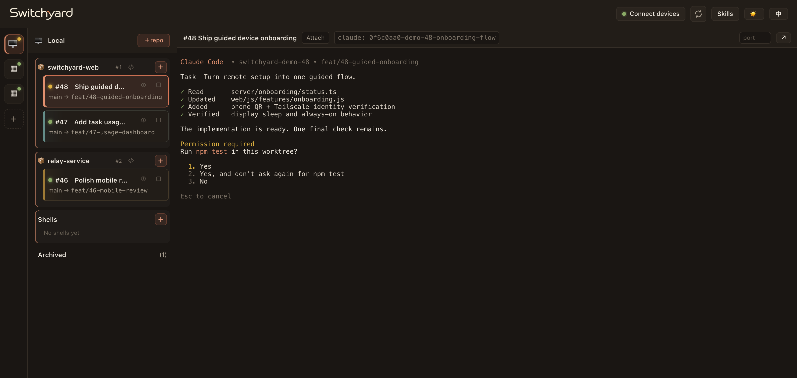
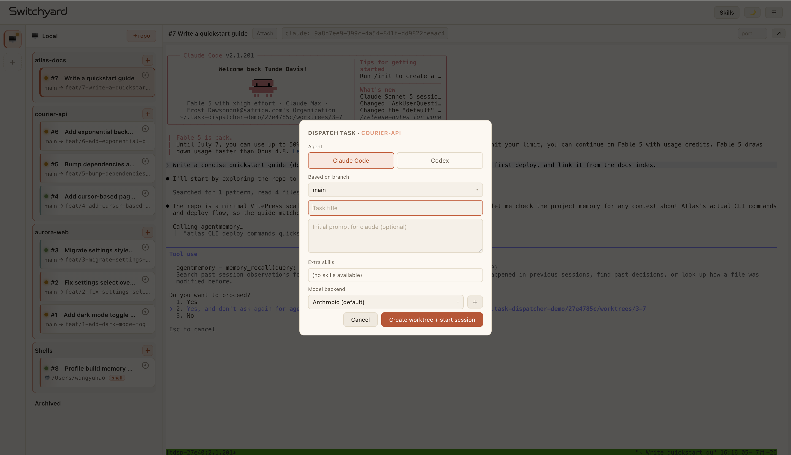
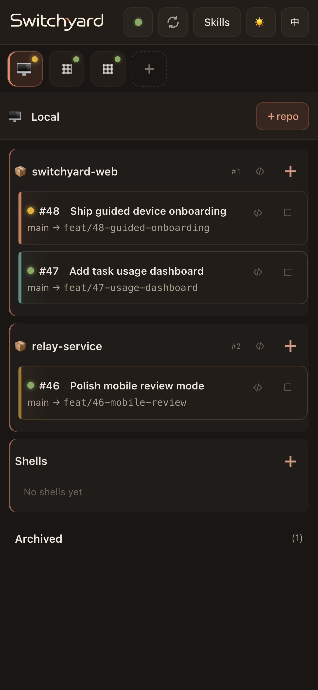
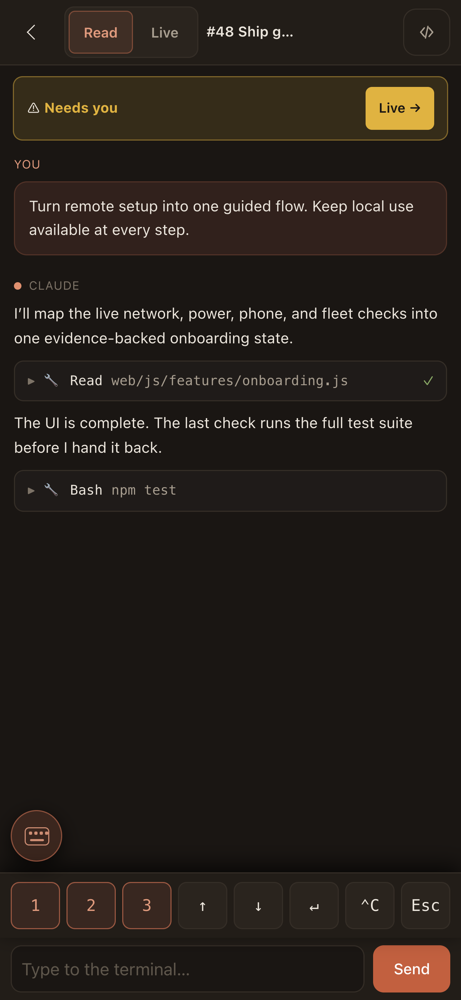
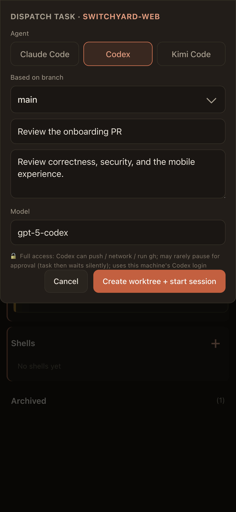

<p align="center">
  
</p>

<p align="center"><a href="README.md">English</a> | 简体中文</p>

> 一个 web 控制台，把「交给 AI 一个编码任务」变成甩一张牌。每个任务都是一个**真实、可交互的 Claude Code、Codex 或 Kimi Code**，跑在自己专属的 git worktree + tmux 会话里；你从浏览器直接进入那个终端，看它干活，随时接管。多个任务并行互不干扰，局域网里的每台机器都是一等节点——在一个页面上派发、围观、收工。手机上同样是完整体验：加到主屏幕就是一个 App。

<p align="center">
  
</p>

## 一个 repo，N 个并行的 worktree 任务

核心玩法以仓库为中心：`+repo` 接入仓库（GitHub / GitLab，注册即克隆），之后对着它随手派任务。**每个任务**自动从你选的基础分支拉出**独立的 git worktree + 独立工作分支 + 独立 tmux 会话**——agent 在自己的目录里干自己的活，互不覆盖工作区、互不打断。想同时推进三个 feature？对同一个仓库派三张卡就是了，回头逐个验收（归档 / 清理 / 删除）。

任务的宿主是机器上的 tmux，**网页只是取景器**：关掉浏览器任务照跑，换台设备打开会话原样都在；也可以随时从自己的终端 `tmux attach` 接管同一个会话，权限确认、斜杠命令这些 TUI 交互在网页里原样可用。

tmux 会话被误杀、主机重启或任务归档也不等于现场丢了：只要 worktree 还在，就能一键用原来的 CLI、模型和端点恢复会话。实时终端还支持直接粘贴剪贴板截图；图片会落到任务所在的本机或远程节点，再交给对应 agent。

> 顺带一提：不挂仓库也能直接开终端——在本机或任何远程节点的 Shells 组点 ＋，在指定目录起一个真 tmux shell（临时排查、跑脚本都行），和仓库任务同一套列表 / 连接 / 归档流程。

## 三种 Agent CLI × 多模型

派发任务时**按任务选 agent CLI**——当前支持 **Claude Code、Codex 与 Kimi Code**，同一块看板上并肩跑，卡片按 CLI 上色，一眼分清。本机、远程完全对等：派到哪台机器，哪台机器就跑你选的 CLI；任务也会记住对应的模型或端点，恢复时沿用。

<p align="center">
  
</p>

- **Claude Code** —— 完整能力：技能注入（派发时勾选官方插件技能，直接送进任务的 worktree）、权限确认黄灯（原生 hook 驱动，见下）。
- **Codex** —— 以 on-request + danger-full-access 启动，能 push、联网、跑 `gh`；派发时可指定本机 Codex 可用的模型 ID，留空使用机器默认。
- **Kimi Code / Kimi K3** —— 以交互式 `--auto` 模式启动，普通工具审批由 Kimi Code 自动处理；使用机器上已登录的 Kimi 账号。可按任务指定模型 ID，例如填 `k3` 使用 [Kimi K3](https://www.kimi.com/code/docs/kimi-code/models.html)（以账号权益为准），留空使用 Kimi Code 默认模型。
- **多模型接入端点** —— 给 Claude Code 配任意 **Anthropic 兼容端点**（如 GLM），同一个 Claude Code TUI 驱动别家模型。添加端点时服务端按 claude 运行时的真实调用方式探测连通性，**绿灯才能保存**；之后每次派发按任务选用，选择会被记住。密钥仅存目标节点本地，不在节点之间传播。

> 当前能力边界：Switchyard 的附加 skill 注入和权限等待黄灯只对 Claude Code 生效；Codex、Kimi Code 暂不注入这些 skill，也不会上报权限等待状态。三种 CLI 都支持实时终端、恢复会话和图片粘贴。

## 多机协同

局域网里每台机器都是一等节点，一页管理：

- **舰队视图** —— 每个节点的仓库和任务经 ssh **现场读取**、按仓库分组；掉线或未安装的节点如实标注，绝不给你看过期数据。
- **派发到任何地方** —— 选中远程节点的仓库直接派；任务在那个节点上创建并归它所有，你在控制台连接/围观/停止，全部经 ssh 转达。远程派发同样有即时的乐观加载卡片，和本机手感一致。
- **一个节点，一份真相** —— 每个节点只保存并操作自己的仓库、任务、worktree、会话和 manifest。远端未安装 Switchyard 时只是一条 SSH 主机记录；仓库与任务操作会明确拒绝，不再降级成由控制端代管。
- **一键装机** —— 控制台里点「安装 tdsp」，经 ssh 把代码和启动器装到远程机器上，装完即用。
- **状态直通** —— running / ready / cloning / errored 各有状态灯；Claude 停在权限确认上等你时，Claude Code 的**原生 hook** 把卡片点成**黄灯**「该你了」——本机远程同一套机制。

## 移动端

窄屏下自动切换成一套完整的触屏体验。**推荐的打开方式：Safari 访问 → 分享 → 「添加到主屏幕」→ 勾选「作为网页 App 打开」**——以独立 App 模式运行（无浏览器边框、深色启动底、无白闪），从此手机上点图标就进控制台，体验最接近原生 App。

<p align="center">
  
  
  
</p>

- **主-详双视图** —— 任务列表和全屏终端两页切换，点卡片进任务，iOS 边缘右划原生返回（接入浏览器 history，实时终端里也能划）。
- **阅读 | 实时 双模式** —— **阅读**把本机 Claude / Codex 任务的会话记录渲染成聊天流：原生滚动、自动追新、工具调用折叠展示，适合躺着翻进度；Claude 等你确认时顶部亮「Needs you」黄条，一键跳**实时**——那个真终端，要出手就在这。远程节点任务与 Kimi Code 的阅读记录尚未接入，目前会直接进入实时终端。
- **贴键盘输入条** —— 输入条钉在 iOS 软键盘正上方，支持多行；每个任务有独立的未发送草稿，切换任务互不串词。
- **触控打磨** —— 禁双击/捏合缩放、禁误选 UI 文字、终端单指拖动 + 惯性滚动、hover 只在真悬停设备生效。

## 安装与启动（每台机器一次）

**前置：** Node 22+，装好 `git` / `tmux`，以及要使用并已完成登录的 agent CLI（`claude` / `codex` / `kimi`）。当前 `setup.sh` 会统一预检 `claude` 与 `kimi`；要运行 Codex 时还需自行确认 `codex` 在非交互 shell 中可达。安装脚本当前面向 zsh。拉代码，一条命令装完：

```sh
git clone <repo-url> switchyard && cd switchyard
./scripts/setup.sh   # 一键装机:环境预检 + npm install + 安装全局 tdsp(幂等,重跑无害)
tdsp serve           # 启动 → http://localhost:4500
```

> `setup.sh` 依次做三件事：① **环境预检**——用非交互 zsh 验证 `claude` / `kimi` / `tmux` / `git` 可达（任务就是用这种只读 `~/.zshenv` 的 shell 启动的，找不到命令任务面板会直接死），缺的把所在目录幂等写进 `~/.zshenv`；② `npm install`（4 个运行时依赖，零构建）；③ 安装全局 `tdsp` 命令（`~/.task-dispatcher/src` 指向这份 clone，启动器链到 `~/.local/bin/tdsp`——敲不到就把 `~/.local/bin` 加进 PATH）。`--check` 只检查、不写不装。

装完之后，一切都是 `tdsp`：

```sh
tdsp serve                            # 启动控制台(只绑本机回环 :4500)
tdsp serve --port 8080                # 换端口
tdsp serve --tailscale                # 回环后端 + tailnet 私有 HTTPS
tdsp serve --host-cidr 10.10.0.0/24   # 额外绑上落在该网段内的本机 IP
tdsp update                           # 更新:拉最新代码 + 刷依赖,重跑 tdsp serve 生效
```

已有 WireGuard / 私有局域网仍可继续用 `--host-cidr`：手机和电脑在同一个网段里，手机直接打开对应地址就是完整控制台：

```
task-dispatcher on http://127.0.0.1:4500
task-dispatcher on http://10.10.0.3:4500
```

## 用 Tailscale 私密接入

Tailscale 是可选的系统网络层，不是 npm 依赖。先在电脑和手机安装 [Tailscale 官方客户端](https://tailscale.com/download)，登录同一个 tailnet，然后运行：

```sh
tdsp serve --tailscale
```

Switchyard 仍然只监听 `127.0.0.1:4500`；`tailscale serve` 把它发布到命令打印的 `https://<机器>.<tailnet>.ts.net`（HTTPS/WSS、仅 tailnet 内可达）。Switchyard 不会开启 Funnel，也不会 reset 其它 Serve 路由。首次使用可能会打开 Tailscale 的 HTTPS 授权页。

各层职责保持很薄：

- **手机 → 控制台：** 经 Tailscale Serve 访问 HTTPS/WebSocket；打开打印的地址，再添加到主屏幕。
- **机器 A → 机器 B：** 在机器栏点击「＋」→「发现设备」。Switchyard 从 Tailscale 的在线节点中只保留同一登录用户，探测兼容节点；点击「连接」后双方交换稳定 instance id、精确 tdsp 路径与各 profile 独立的 Ed25519 公钥，并双向登记。没有配对码，也不会复用或改写个人 SSH key。
- **实际控制：** 节点协议仍是 `ssh B tdsp …`。Tailscale 负责发现、身份与网络可达，SSH 负责命令/终端/文件传输。专用 key 会写入双方 `~/.ssh/authorized_keys` 的独立标记行；若系统尚未开启 SSH/Remote Login，连接仍会保存为「SSH 尚未就绪」，开启后后台探测会自动转绿。
- **路径选择：** Tailscale 自动尝试 WireGuard 直连，再尝试已配置的 Peer Relay，最后才走 DERP。可以直接诊断，不必猜：

```sh
tdsp network status
tdsp network diagnose <对端名称或100.x地址>
```

如果两端都在严格 NAT 后面、DERP 又绕得很远，可以把同城 VPS 配成 [Tailscale Peer Relay](https://tailscale.com/docs/features/peer-relay)。VPS 只需 Tailscale 1.86+、一个可达的 UDP 端口，以及精确限定范围的 tailnet grant；它**不需要**运行 Switchyard：

```sh
sudo tailscale set --relay-server-port=40000
# 如果 VPS 也装了 tdsp 且有权限管理 tailscaled，也可以：
tdsp network relay enable --port 40000
# 然后在 tailnet 策略中，给选定源设备授予到这台 VPS 的 tailscale.com/cap/relay
tdsp network diagnose <对端>            # 最终路径应显示 peer-relay
```

VPS 上运行 `tdsp network relay disable` 只关闭该中继监听；`tdsp network off --https-port 443` 只移除 Switchyard 默认的 Serve 监听。

### 并行灰度环境（不碰现有 `:4500`）

隔离 profile 拥有独立的 sqlite、namespace、mirror、worktree、SSH socket、启动器和端口，只共享当前 checkout：

```sh
npm run -s tdsp -- install --profile tailscale-test
~/.task-dispatcher/profiles/tailscale-test/bin/tdsp \
  serve --port 14500 --tailscale --tailscale-port 14500
```

如果 tailnet 管理员还没启用 Serve HTTPS，该命令会打印一次性授权地址并退出，不会绑定任何端口。授权前仍可用显式 HTTP 灰度方式测试 Tailscale 底层网络，而且只绑定这台节点的 `100.64.0.0/10` 地址：

```sh
tdsp-tailscale-test serve --port 14500 --host-cidr 100.64.0.0/10
```

另一台机器拉同一分支，也执行这两条命令。打开任一灰度面板，点击机器栏「＋」即可发现另一台 `tailscale-test`，点击「连接」会交换灰度 profile 的精确启动器和独立 SSH key；两边都不会调用正式 `tdsp`，也不会打开正式数据库。手动 SSH 目标 + profile 表单仍作为高级回退入口。只清理灰度 Serve 监听可运行：

```sh
tdsp-tailscale-test network off --https-port 14500 --port 14500
```

## 使用

1. **添加仓库** —— 名字 + git 地址（GitHub / GitLab；https 私有仓库填 token，SSH 留空）。注册并克隆，状态变 `ready`。
2. **派发任务** —— 选仓库 → 基础分支 → 标题 + 开场指令 → 选 agent（Claude Code / Codex / Kimi Code）→ Claude 可选 skill 与模型端点，Codex / Kimi 可选模型 ID。自动建 worktree、开工。
3. **进终端** —— 右侧面板自动连上；卡片上的「进入终端」随时重连。你面对的就是真 agent。
4. **收尾** —— 归档（杀会话、留 worktree）/ 清理（杀会话 + 删 worktree）/ 删除（移除记录）。

### 添加远程机器

1. **注册** —— 在控制台填名字 + ssh 目标（如 `user@host`）。后台探针会显示它的在线状态。
2. **在它上面装 tdsp** —— 打开机器的 ⚙ 菜单，点**安装 tdsp**。一键经 ssh 完成：在那边 clone 代码（已有 clone 则复用）并装好启动器。
   - 已经自己跑控制台的机器本来就有 clone——在那台机器上跑一次 `npm run tdsp -- install`（复用现有 clone，不产生第二份），再回控制台点安装登记为就绪即可。
3. **用起来** —— 这台机器的仓库和实时任务出现在页面上，按仓库分组。选**它的**仓库派发（仓库组上的 ＋），或在它上面开 shell（Shells 组的 ＋）。

## tdsp 命令

每台机器跑的都是同一个 `tdsp`；控制端对远程执行一次性子命令即 `ssh <node> tdsp …`。

| 命令 | 作用 |
|---|---|
| `tdsp serve` | 启动 web 控制台；`--port <端口>` 修改回环端口，`--tailscale` 经 Tailscale Serve 私密发布 |
| `tdsp network status` / `setup` / `diagnose` / `off` | 检查 Tailscale、发布一个回环后端、识别直连/Peer Relay/DERP 路径，或移除一个 Serve 监听 |
| `tdsp network relay enable` / `disable` | 配置本机的 Peer Relay UDP 监听（tailnet grant 仍需管理员明确配置） |
| `tdsp list` | 以 JSON 打印本机任务 + 仓库 |
| `tdsp create-local` | 在本机开一个裸 shell 任务 |
| `tdsp create` | 在本机创建仓库任务（由控制端驱动） |
| `tdsp repo-create` / `repo-fetch` / `repo-branches` / `repo-delete` | 操作本机自己的仓库目录（节点控制命令） |
| `tdsp stop <id>` | 停止本机的一个任务 |
| `tdsp resume` / `cleanup` / `delete-task` | 操作本机自己的归档任务 |
| `tdsp doctor legacy [--json]` | 只读审计旧版本在控制端留下的远端归属记录与失效归属引用 |
| `tdsp install` | 用本机这份 clone 装好全局 `tdsp`；`--profile <名称>` 创建完全隔离的并行启动器 |
| `tdsp update` | 更新本机安装：对 `~/.task-dispatcher/src` 指向的 clone 执行 `git pull --ff-only` + `npm install`；重启 serve 生效 |

## 说明

- **安全** —— 服务**默认只绑回环 `127.0.0.1`**，局域网碰不到。优先用 `tdsp serve --tailscale`：应用仍在回环，Tailscale Serve 终止 tailnet 私有 HTTPS，tailnet 访问策略照常生效。也可用 ssh 隧道 `ssh -L 4500:localhost:4500 host`，或显式 `--host-cidr`。`HOST=0.0.0.0` 会把 web 终端交给任何能碰到端口的人，**务必自加认证/反向代理，绝不裸奔公网**。访问其它节点继续使用 SSH key 或 Tailscale SSH 策略。token 以**明文**存在 sqlite 里——仅限本地个人使用。
- **终端手感** —— 给 claude 开全屏渲染（会话里 `/tui fullscreen`，或每台机器的 `~/.claude/settings.json` 加 `{"tui":"fullscreen"}`），输入框固定、滚动顺滑、不再横向跳动。

## 结构

```
server/                REST API + /pty WebSocket;tdsp CLI;git / tmux / pty / ssh 的 Runner 编排
  index.ts             HTTP 入口:组装 app + http server,挂 WS,跑 boot,监听
  tdsp.ts              tdsp 入口(serve + 一次性子命令)
  http/                web 层 —— 盖在下面领域目录上的薄 HTTP 胶水
    app.ts             组装 express: json → 预览代理 → 静态 → 路由
    routes.ts          全部 /api/* 处理器
    ws.ts              upgrade 路由 + pty/tmux 终端中继
    preview.ts         dev-server 反向代理的上游解析
    context.ts         共享预编译语句 + 横切工具
  core/                路径、sqlite 库与 schema、迁移、服务端 i18n
  repo/                git 镜像、worktree、每任务的 repo 环境
  task/                任务生命周期(创建/清单/改名) + tdsp 节点本地 API(cli.ts)
  fleet/               远程主机:runner、bootstrap、存活探测、跨节点舰队视图
  network/             Tailscale 状态、私有 Serve 发布、路径诊断、Peer Relay 配置
  session/             tmux 会话、pty 派生、attach 命令、agent 启动参数(claude / codex / kimi)
  skills/              技能扫描/解析、插件安装、hook 设置
  preview/             预览反向代理引擎
web/                   看板 + xterm 终端(原生 ES Modules,零构建)
  js/main.js           入口 —— 接线各模块,桥接内联 onclick
  js/core/             共享底座:dom、state、feedback、dialog、select
  js/features/         hosts、tasks、terminal、repos、providers、skills、reorder、mobile、reading
scripts/setup.sh       预检:校验 agent CLI + git/tmux,修 ~/.zshenv 的 PATH
~/.task-dispatcher/    每台机器:
  src                  指向本机 clone 的指针(真 clone 或软链)
  bin/tdsp             全局启动器 → src
  profiles/<name>/     隔离的灰度启动器 + 源码指针 + 数据根目录
  <namespace>/         本机自己的数据: mirrors/ worktrees/ tasks/ dispatcher.db
```

> 服务端和前端各带一份中/英文案字典（`server/core/i18n.ts`、`web/i18n.js`），是各自层的唯一事实来源。更细的数据模型与节点语义见源码注释。
